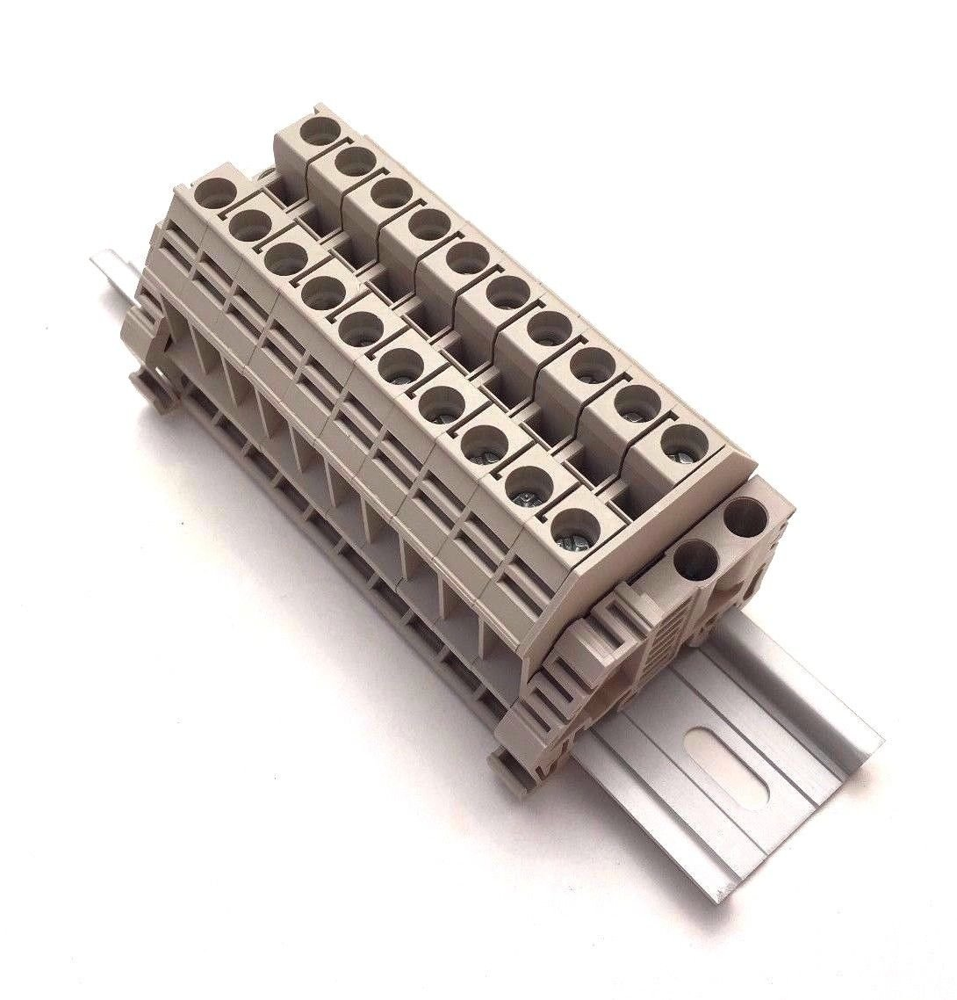
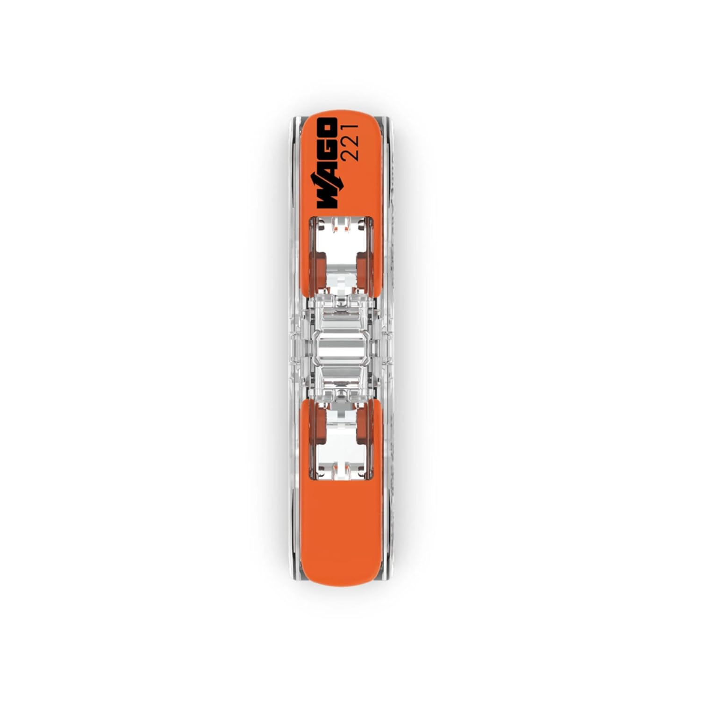
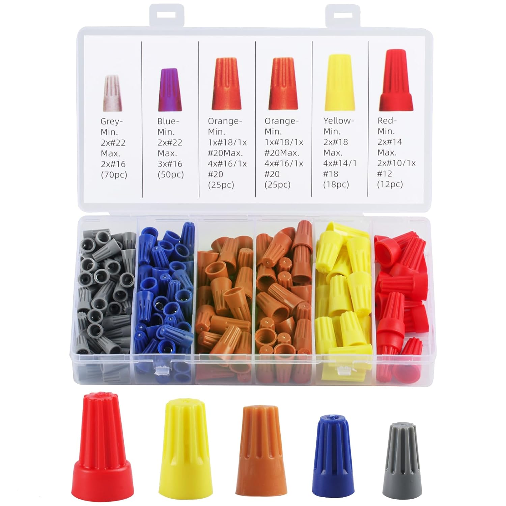
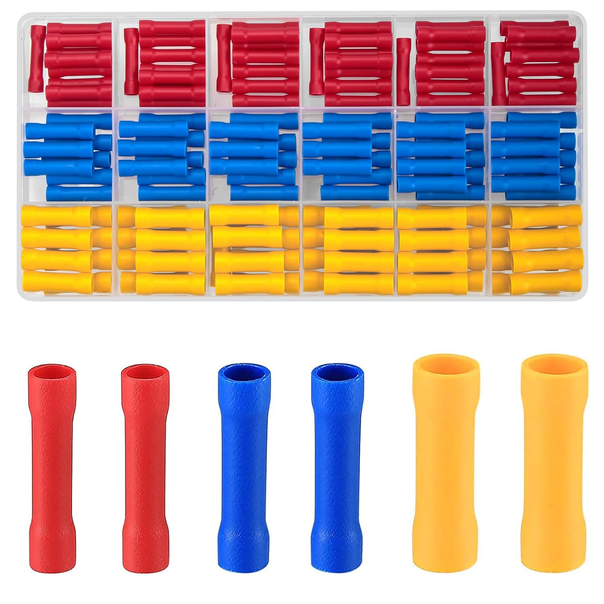

# Connectors Reference (with image placeholders)

> Save to a folder named `images/` and place matching image files there (e.g. `images/wago_push_in.jpg`) so the download
> links work locally.

| #  | Connector                                |                                                    Short Description |                               Example Image                                |
|----|------------------------------------------|---------------------------------------------------------------------:|:--------------------------------------------------------------------------:|
| 1  | **Wago / Push-in Connector**             | Push-in lever / push-in terminal for quick splices (solid/stranded). |                |
| 2  | **Screw Terminal (Barrier / Strip)**     |                    Screw-down terminals for panel wiring and blocks. |              |
| 3  | **DIN-rail Terminal Block**              |                        Modular terminal blocks mounted on DIN rails. |     |
| 4  | **Wago / Lever Connector**               |                     Reusable lever-actuated connectors (multi-wire). |        |
| 5  | **Wire Nut / Twist Connector**           |           Insulating nut for twisting wires together (common in US). |    |
| 6  | **Butt Splice / Butt Connector**         |                           Crimp sleeve for joining two wires inline. |  |
| 7  | **Heat-Shrink Butt Connector**           |                Butt splice with adhesive and heat-shrink insulation. |                                   |
| 8  | **Ferrule (Bootlace Crimp)**             |         Crimp sleeve for stranded wire ends used in screw terminals. |                                   |
| 9  | **Ring Terminal**                        |               Ring-shaped lug for bolted connections (earth/ground). |                                   |
| 10 | **Spade / Fork Terminal**                |                     Forked lug for quick screw-terminal connections. |                                   |
| 11 | **Blade / Faston / Faston Tab**          |                   Flat blade terminal used on appliances and relays. |                                   |
| 12 | **Crimp Pin / Socket (for housings)**    |       Individual crimp contacts for connector housings (Molex, JST). |                                   |
| 13 | **Molex (KK) Connector**                 |                    Common board-to-wire power/data connector family. |                                   |
| 14 | **JST (SM, PH, XH)**                     |              Small pitch PCB-to-wire connectors used in electronics. |                                   |
| 15 | **Dupont / IDC Header**                  |                   Simple 2.54mm header and crimp housings (jumpers). |                                   |
| 16 | **RJ45 (Ethernet)**                      |                           8P8C modular connector for network cables. |                                   |
| 17 | **RJ11 (Telephone)**                     |                           6P2/6P4 modular connector for phone lines. |                                   |
| 18 | **BNC (Bayonet)**                        |                         Coaxial connector for RF and test equipment. |                                   |
| 19 | **SMA / RP-SMA**                         |                                  Small RF coax connector (antennas). |                                   |
| 20 | **Banana Plug / Jack**                   |                                   4mm plug for lab/test connections. |                                   |
| 21 | **Anderson Powerpole / SB50**            |              Genderless power connectors for DC power and batteries. |                                   |
| 22 | **XT60 / XT90**                          |              High-current RC battery connectors (commonly for LiPo). |                                   |
| 23 | **MC4 (Solar)**                          |                           Waterproof PV connectors for solar panels. |                                   |
| 24 | **IEC C13 / C14**                        |                 Mains appliance inlet and cord connector (PC power). |                                   |
| 25 | **USB-A / USB-C / Micro-USB**            |                            Common data/power connectors for devices. |                                   |
| 26 | **Coax F-connector**                     |                            Threaded RF connector for TV/coax cables. |                                   |
| 27 | **Solder Sleeve / Solder Seal**          |                   Heat-activated solder tube for waterproof splices. |                                   |
| 28 | **Push-In (Backstab) Socket Connectors** |           Quick push-in connectors inside some outlets and fixtures. |                                   |
| 29 | **Wire-to-Board IDC**                    |         Insulation-displacement connector for ribbon or flat cables. |                                   |
| 30 | **Terminal Lug / Cable Lug**             |               Heavy-duty lug for bolting large cross-section cables. |                                   |
| 31 | **Heat Shrink Tubing (with adhesive)**   |           Not a connector but used to insulate and seal connections. |                                   |

---

## Usage notes (placeholders only)

- Filenames in `images/` should match the names above (lowercase, underscores).
- If you want, I can fetch public-domain or Creative-Commons images and populate `images/` with real downloadable files
  for you.

